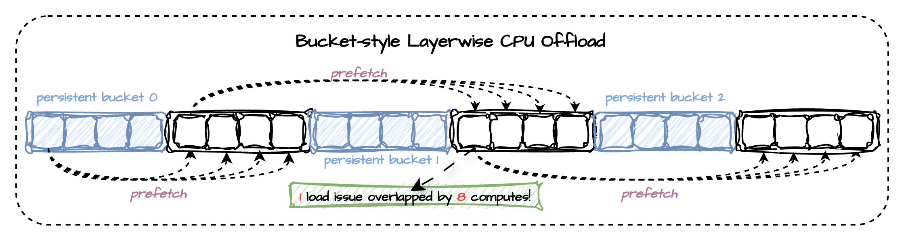

# Layerwise Offload

## Overview



Cache-DiT's layerwise offload is designed around a <span style="color:green;">bucket-style execution pattern</span> instead of a strictly one-layer-in, one-layer-out schedule. The selected modules are divided into small contiguous buckets. While the current bucket is executing on CUDA, runtime can already prefetch the next bucket and keep a few strategically chosen buckets persistent on device. This turns the weight movement path into a short pipeline: one copy issue can be hidden behind multiple compute steps, rather than forcing each layer to wait for its own isolated host-to-device transfer.

|FLUX.1-dev, L20, w/o offload| sequential offload (diffusers) | cpu offload (diffusers) | layerwise (cache-dit) |
|:---:|:---:|:---:|:---:|
|~38GiB|~1GiB|~25GiB|~1GiB|
|**23.4s**|335s|56s|49s|
|+ transfer buckets(1) | + persistent buckets(4)|+ transfer buckets(4) + persistent buckets(8)| + transfer buckets(4) + persistent buckets(32) + bins(4) + prefetch limit| 
|~4GiB|~8GiB|~14GiB|~16GiB|
|41s|33s|<span style="color:green;">26s</span>|<span style="color:green;">24.6s</span>|

The main benefit of this bucket-style design is better overlap between communication and compute. Compared with naive sequential offload, it gives runtime a wider window to overlap CPU<->GPU weight transfers with the execution of nearby layers, so the GPU spends less time idling on transfer boundaries. In practice, `transfer_buckets`, `persistent_buckets`, `persistent_bins`, and optional `prefetch_limit` let you trade a moderate amount of extra residency for noticeably better overlap, which is why bucket-style layerwise offload usually reaches a much better latency/memory balance than pure per-layer offload.

## Basic Usage

Cache-DiT provides a generic layerwise offload utility for `nn.Module` components. It keeps the selected submodules on the `offload_device` between forwards, moves them to the `onload_device` just before execution, and then offloads them again after the layer finishes.

This is useful when a model or component does not fit comfortably in GPU memory, but you still want to run the forward pass on CUDA one layer at a time. The public APIs are:   

- <span style="color:#c77dff;">layerwise_offload(...)</span>: generic onload/offload wrapper;   
- <span style="color:#c77dff;">layerwise_cpu_offload(...)</span>: convenience wrapper for CPU offload;  
- <span style="color:#c77dff;">remove_layerwise_offload(...)</span>: remove all registered layerwise offload hooks from a root module.

By default, <span style="color:#c77dff;">layerwise_cpu_offload</span> selects leaf modules under the root module. You can narrow the scope with <span style="color:#c77dff;">module_names=[...]</span> or <span style="color:#c77dff;">module_filter=...</span> when you only want to offload part of the
module tree.

```python
import cache_dit

cache_dit.layerwise_offload(
  model_or_pipeline, 
  onload_device="cuda", 
  offload_device="cpu",
)
```

## Pipeline Component

In practice, you will usually apply layerwise offload to a large component such as a transformer module instead of the whole pipeline object. If you only want to offload specific submodules, pass explicit names:

```python
import cache_dit

handle = cache_dit.layerwise_offload(
  pipe.transformer,
  onload_device="cuda",
  offload_device="cpu",
  module_names=["transformer_blocks.0", "transformer_blocks.1"],
)
```

## Overlap with Prefetch

For CUDA onload plus CPU offload, you can enable asynchronous state transfers:

```python
import cache_dit

handle = cache_dit.layerwise_offload(
  pipe.transformer,
  onload_device="cuda",
  offload_device="cpu",
  async_transfer=True,
  transfer_buckets=2,
  persistent_buckets=32,
  persistent_bins=4,
  prefetch_limit=True,
  max_copy_streams=4,
  max_inflight_prefetch_bytes="4gib",
)
# when you want to remove the offload hooks.
handle.remove()
```

<span style="color:green;">transfer_buckets</span>: Base async prefetch depth hint used to size copy-lane concurrency. By default, cache-dit no longer applies an implicit future-target count limit from this value.

<span style="color:green;">prefetch_limit</span>: Optional conservative future-prefetch target-count limit. When enabled, runtime caps pending/ready future targets to `min(4 * transfer_buckets, 8)`. Leave it disabled if you want the aggressive prefetch behavior and only rely on explicit byte-budget limits.

<span style="color:green;">max_copy_streams</span>: Maximum number of async CUDA copy streams used by layerwise offload. This caps copy-lane concurrency without changing the logical lookahead depth implied by `transfer_buckets`. When omitted, runtime derives it from `transfer_buckets` and still applies its internal safety cap.

<span style="color:green;">max_inflight_prefetch_bytes</span>: Maximum total CUDA residency budget, in bytes, that async future-target prefetch may consume at once. This caps the combined footprint of both pending transfers and ready-but-not-yet-consumed prefetched targets, even when the effective prefetch window requests a deeper lookahead. When omitted, runtime does not apply an implicit byte-budget cap. The Python API still takes raw bytes. The CLI accepts raw bytes or size suffixes such as `512MiB`, `4GiB`, `8GiB`, and `16GiB`.

<span style="color:green;">persistent_buckets</span>: How many selected targets should stay resident on the onload device for the full handle lifetime instead of participating in per-forward onload/offload. These targets are materialized onto the onload device during handle creation, before the first forward starts.

<span style="color:green;">persistent_bins</span>: How many evenly distributed bins should be used when placing the `persistent_buckets` budget across the target list. A value of 1 keeps the original prefix behavior. Larger values spread persistent targets across multiple uniformly spaced ranges, which can improve overlap in deeper models without concentrating the full persistent budget only at the beginning.

Concrete example: if the selected target list has 32 targets, `persistent_buckets=16`, and `persistent_bins=4`, runtime keeps four evenly spaced persistent ranges resident on CUDA: `[t0, ..., t3]`, `[t8, ..., t11]`, `[t16, ..., t19]`, and `[t24, ..., t27]`.


Notes: <span style="color:#c77dff;">async_transfer=True</span> currently requires CUDA onload and CPU offload. <span style="color:#c77dff;">transfer_buckets</span> mainly controls copy-lane sizing, while <span style="color:#c77dff;">prefetch_limit</span> optionally enables the conservative future-target count cap <span style="color:#c77dff;">min(4 * transfer_buckets, 8)</span>. <span style="color:#c77dff;">max_copy_streams</span> limits copy-lane concurrency and <span style="color:#c77dff;">max_inflight_prefetch_bytes</span> limits how much future-target weight state may already be resident on GPU across both pending and ready prefetched targets, but only when you set it explicitly. If you leave <span style="color:#c77dff;">prefetch_limit</span> disabled and do not set a byte budget, runtime may aggressively prefetch many future targets, which can improve overlap but also increase peak/reserved CUDA memory. Prefer starting with <span style="color:#c77dff;">transfer_buckets=1</span> or <span style="color:#c77dff;">2</span>, keeping <span style="color:#c77dff;">max_copy_streams</span> modest, and only adding <span style="color:#c77dff;">prefetch_limit</span> or <span style="color:#c77dff;">max_inflight_prefetch_bytes</span> when you specifically need to rein in memory pressure.

## Quick CLI Example

Quick start with Cache-DiT's example CLI for layerwise offload:

```bash
python3 -m cache_dit.generate flux \
  --layerwise-offload \
  --layerwise-async-transfer \
  --layerwise-transfer-buckets 4 \
  --layerwise-persistent-buckets 32 \
  --layerwise-persistent-bins 4 \
  --layerwise-prefetch-limit \
  --layerwise-max-inflight-prefetch-bytes 4gib \
  --layerwise-text-transfer-buckets 1 \
  --layerwise-text-persistent-buckets 4 \
  --layerwise-text-persistent-bins 1 \
  --layerwise-text-max-inflight-prefetch-bytes 2gib
```

This will enable cache-dit's layerwise CPU offload for `nn.Module` components or pipeline. The text encoder is configured with a more conservative offload strategy since it is usually less expensive to offload and reload its weights on demand (only call once per denoising loop), while the transformer (call multiple times per denoising loop) module is configured with a more aggressive strategy that keeps more buckets resident and also allows a deeper async prefetch window. Adjust the offload parameters as needed to find the best latency/memory balance for your specific model and hardware.
