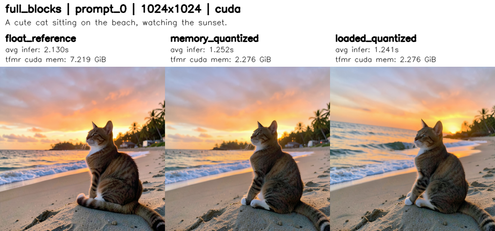

# Low-bits Quantization

<div id="quantization"></div>

## Overview

Quantization is a powerful technique to reduce the memory footprint and computational cost of deep learning models by representing weights and activations with lower precision data types. Cache-DiT supports various quantization methods, including <span style="color:green;">FP8</span>, <span style="color:green;">INT8</span>, and <span style="color:green;">INT4</span> quantization, to help users achieve faster inference and lower memory usage while maintaining acceptable model performance.

|Quantization Types| Description|Devices|
|:---|:---|:---| 
|<span style="color:#c77dff;">float8_per_row</span> |quantize weights and activations to float8 (<span style="color:green;">dynamic quantization</span>) with rowwise method. (**<span style="color:#c77dff;">recommended</span>**)|<span style="color:#c77dff;">>=sm89</span>, Ada, Hopper or newer|
|<span style="color:#c77dff;">float8_per_tensor</span>|quantize weights and activations to float8 (<span style="color:green;">dynamic quantization</span>) with tensorwise method.|<span style="color:#c77dff;">>=sm89</span>, Ada, Hopper or newer|
|<span style="color:#c77dff;">float8_per_block</span>|block-wise quantization weights and activations (<span style="color:green;">dynamic quantization</span>) to float8, which can provide better precision, activations's blocksize: (1, 128), weight's blocksize: (128, 128) |<span style="color:#c77dff;">>=sm89</span>, Ada, Hopper or newer|
|<span style="color:#c77dff;">float8_weight_only</span>|quantize <span style="color:green;">only weights</span> to float8, keep activations in full precision|<span style="color:#c77dff;">>=sm89</span>, Ada, Hopper or newer|
|<span style="color:#c77dff;">int8_per_row</span>|quantize weights and activations to int8 (<span style="color:green;">dynamic quantization</span>) with rowwise method.|<span style="color:#c77dff;">>=sm80</span>, Ampere or newer|
|<span style="color:#c77dff;">int8_per_tensor</span>|quantize weights and activations to int8 (<span style="color:green;">dynamic quantization</span>) with tensorwise method.|<span style="color:#c77dff;">>=sm80</span>, Ampere or newer|
|<span style="color:#c77dff;">int8_weight_only</span>|quantize <span style="color:green;">only weights</span> to int8, keep activations in full precision|<span style="color:#c77dff;">>=sm80</span>, Ampere or newer|
|<span style="color:#c77dff;">int4_weight_only</span>|quantize <span style="color:green;">only weights</span> to int4, keep activations in full precision|<span style="color:#c77dff;">>=sm90</span>, Hopper or newer, TMA required|
|<span style="color:#c77dff;">svdq_int4_r{32...}</span>|quantize weights and activations to int4 with <span style="color:green;">SVDQuant (W4A4)</span> method, which can provide better precision for INT4 quantization. The low-rank value can be 16, 32, 64, 128, etc.|<span style="color:#c77dff;">>=sm80</span>, Ampere or newer, excluded Hopper (NO INT4 MMA)|


## FP8 Quantization

Currently, Cache-DiT supports <span style="color:#c77dff;">online</span> quantization with different quantization types via TorchAo backend (<span style="color:green;">torchao>=0.17.0</span> required). Users can implement model quantization by calling <span style="color:#c77dff;">quantize</span> or pass a <span style="color:#c77dff;">QuantizeConfig</span> to <span style="color:#c77dff;">enable_cache</span> API. Please make sure to install the latest version of torchao before using quantization features.

```bash
# stable: torchao (change cu130 to cu129 if using CUDA 12.9)
uv pip install torchao --index-url https://download.pytorch.org/whl/cu130 --upgrade
# nightly: torchao (change cu130 to cu129 if using CUDA 12.9)
uv pip install --pre torchao --index-url https://download.pytorch.org/whl/nightly/cu130 --upgrade
```

For GPUs with low memory capacity, we recommend using <span style="color:#c77dff;">float8_per_row</span> or <span style="color:#c77dff;">float8_per_block</span>, as these methods cause almost no loss in precision. We also recommend enabling <span style="color:#c77dff;">torch.compile</span> for better performance with quantization. Supported quantization types including:  

  - <span style="color:#c77dff;">float8_per_row</span>: quantize both weights and activations to float8 (dynamic quantization) with rowwise method.  
  - <span style="color:#c77dff;">float8_per_tensor</span>: quantize both weights and activations to float8 (dynamic quantization) with tensorwise method.  
  - <span style="color:#c77dff;">float8_per_block</span>: block-wise quantization weights and activations (dynamic quantization) to float8, which can provide better precision, activations's blocksize: (1, 128), weight's blocksize: (128, 128). **NOT** supported for distributed inference for now.
  - <span style="color:#c77dff;">float8_weight_only</span>: quantize only weights to float8, keep activations in full precision.  

Here are some examples of how to use quantization with cache-dit. You can directly specify the quantization config in the <span style="color:#c77dff;">enable_cache</span> API.

```python
import cache_dit
from cache_dit import DBCacheConfig, ParallelismConfig, QuantizeConfig

# quant_type: float8_per_row, float8_per_tensor, float8_per_block, float8_weight_only, 
# int8_per_row, int8_per_tensor, int8_weight_only, int4_weight_only, etc.
# Pass a QuantizeConfig to the `enable_cache` API.
cache_dit.enable_cache( 
    pipe, cache_config=DBCacheConfig(), # w/ default
    parallelism_config=ParallelismConfig(ulysses_size=2),
    quantize_config=QuantizeConfig(quant_type="float8_per_row"),
)
```

Users can also specify different quantization configs for different components. For example, quantize the <span style="color:#c77dff;">transformer</span> to <span style="color:#c77dff;">float8_per_row</span> and the <span style="color:#c77dff;">text encoder</span> to <span style="color:#c77dff;">float8_weight_only</span>.

```python
import cache_dit
from cache_dit import DBCacheConfig, ParallelismConfig, QuantizeConfig

cache_dit.enable_cache( 
    pipe, cache_config=DBCacheConfig(), # w/ default
    parallelism_config=ParallelismConfig(ulysses_size=2),
    quantize_config=QuantizeConfig(
        components_to_quantize={
            "transformer": {
                "quant_type": "float8_per_row",
                "exclude_layers": ["embedder", "embed"],
            },
            "text_encoder": {
                "quant_type": "float8_weight_only",
                "exclude_layers": ["lm_head"],
            }
        }
    ),
)
```

Or, directly call the <span style="color:#c77dff;">quantize</span> API for more fine-grained control.

```python
import cache_dit
from cache_dit import QuantizeConfig

cache_dit.quantize(
    pipe.transformer, 
    quantize_config=QuantizeConfig(quant_type="float8_per_row"),
)
cache_dit.quantize(
    pipe.text_encoder, 
    quantize_config=QuantizeConfig(quant_type="float8_weight_only"),
)
```

Please also enable <span style="color:#c77dff;">torch.compile</span> for better performance with quantization.

```python
import cache_dit

cache_dit.set_compile_configs()
pipe.transformer = torch.compile(pipe.transformer)
pipe.text_encoder = torch.compile(pipe.text_encoder)
```

Users can set <span style="color:green;">exclude_layers</span> in <span style="color:#c77dff;">QuantizeConfig</span> to exclude some sensitive layers that are not robust to quantization, e.g., embedding layers. Layers that contain any of the keywords in the<span style="color:green;">exclude_layers</span> list will be excluded from quantization. For example: 

```python
import cache_dit
from cache_dit import DBCacheConfig, ParallelismConfig, QuantizeConfig

cache_dit.enable_cache( 
    pipe, cache_config=DBCacheConfig(), # w/ default
    parallelism_config=ParallelismConfig(ulysses_size=2),
    quantize_config=QuantizeConfig(
        quant_type="float8_per_row",
        exclude_layers=["embedder", "embed"],
    ),
)
```
By default, <span style="color:green;">quant_type="float8_per_row"</span> for better precision. Users can set it to "float8_per_tensor" to use per-tensor quantization for better performance on some hardware.

## Regional Quantization

Cache-DiT also supports <span style="color:green;">regional quantization</span>, which allows users to quantize only the repeated blocks in a transformer. This can be useful for better balancing the <span style="color:#c77dff;">precision</span> and efficiency. Users can specify the blocks to be quantized via the <span style="color:green;">regional_quantize</span> and <span style="color:green;">repeated_blocks</span> arguments in <span style="color:#c77dff;">QuantizeConfig</span>. For example, to quantize repeated blocks of the Flux2's transformer:

```python
import cache_dit
from cache_dit import DBCacheConfig, ParallelismConfig, QuantizeConfig

cache_dit.enable_cache( 
    pipe, cache_config=DBCacheConfig(), # w/ default
    parallelism_config=ParallelismConfig(ulysses_size=2),
    quantize_config=QuantizeConfig(
        quant_type="float8_per_row",
        # Default (True), only quantize the repeated blocks in transformer if the repeated_blocks is 
        # specified. If set to False, the whole transformer will be quantized.
        regional_quantize=True, 
        # Specify the block names for the transformer, cache-dit will automatically find the repeated 
        # blocks and quantize it inplace. The block names can be found in the model architecture, e.g., 
        # for FLUX.2, the block name is "Flux2TransformerBlock" and "Flux2SingleTransformerBlock".
        repeated_blocks=['Flux2TransformerBlock', 'Flux2SingleTransformerBlock'],
        # repeated_blocks will be detected automatically from diffusers' transformer class, namely:
        # default repeated_blocks = transformer._repeated_blocks if exists, else None (quantize 
        # the whole transformer.
    ),
)
```

## FP8 Per-Tensor Fallback

The <span style="color:green;">per_tensor_fallback</span> option in Cache-DiT's quantization configuration allows users to enable a fallback mechanism for layers that do not support float8 per-row or per-block quantization. This is particularly useful in scenarios where tensor parallelism is applied, and certain layers (e.g., those applied with RowwiseParallel) may encounter memory layout mismatch errors when quantized to float8 per-row.

When <span style="color:green;">per_tensor_fallback</span> is set to True, if a layer cannot be quantized to float8 per-row or per-block, it will automatically fall back to float8 per-tensor quantization instead of raising an error. This ensures that the quantization process can continue smoothly without interruption, while still providing the benefits of reduced precision for supported layers.  

To enable this feature, simply set the <span style="color:green;">per_tensor_fallback</span> flag to <span style="color:#c77dff;">True (default)</span> in the <span style="color:#c77dff;">QuantizeConfig</span> when calling the <span style="color:#c77dff;">enable_cache</span> API. Only support for float8 quantization for now. For example:

```python
import cache_dit
from cache_dit import DBCacheConfig, ParallelismConfig, QuantizeConfig

cache_dit.enable_cache( 
    pipe, cache_config=DBCacheConfig(), # w/ default
    parallelism_config=ParallelismConfig(tp_size=2),
    quantize_config=QuantizeConfig(
        quant_type="float8_per_row",
        # Must be True to enable fp8 per-tensor fallback.
        regional_quantize=True, # default, True.
        repeated_blocks=['Flux2TransformerBlock', 'Flux2SingleTransformerBlock'],
        # Enable fallback to float8 per-tensor quantization, default to True
        # for better compatibility for layers that do not support float8 per-row 
        # quantization, e.g., layers with RowwiseParallel applied in tensor parallelism.
        per_tensor_fallback=True, 
    ),
)
```

For examples, without fp8 per-tensor fallback, the cache-dit will auto skip the layers that do not support float8 per-row quantization, and raise warning for those layers. The performance will be worse due to less layers being quantized. (<span style="color:#c77dff;">quantize 88 layers, skip 56 layers</span>)

```bash
# w/o fp8 per-tensor fallback, quantize 88 layers, skip 56 layers, performance downgrade.
torchrun --nproc_per_node=2 -m cache_dit.generate flux2_klein_9b_kv_edit \
   --parallel tp --compile --float8-per-row --q-verbose \
   --disable-per-tensor-fallback
```

```bash
-----------------------------------------------------------------------------------
Quantized        Region: ['Flux2TransformerBlock', 'Flux2SingleTransformerBlock']  |
Quantized Linear Layers: 88    float8_per_row     56 (skipped)                     |
Quantized Linear Layers: 88    (total)                                             |
Skipped   Linear Layers: 56    (total)                                             |
Linear           Layers: 144   (total)                                             |
-----------------------------------------------------------------------------------
------------------------------------------------------------------------------------
float8_per_row, skip: attn.to_out.0        : pattern<RowwiseParallel>: 8    layers  |
float8_per_row, skip: attn.to_add_out      : pattern<RowwiseParallel>: 8    layers  |
float8_per_row, skip: ff.linear_out        : pattern<RowwiseParallel>: 8    layers  |
float8_per_row, skip: ff_context.linear_out: pattern<RowwiseParallel>: 8    layers  |
float8_per_row, skip: attn.to_out          : pattern<RowwiseParallel>: 24   layers  |
------------------------------------------------------------------------------------
```

With fp8 per-tensor fallback enabled, those layers that do not support float8 per-row quantization will be quantized to float8 per-tensor instead, and the performance will be better due to more layers being quantized. (<span style="color:#c77dff;">quantize 144 layers, skip 0 layer</span>)

```bash
# w/ fp8 per-tensor fallback enabled, quantize 144 layers, skip 0 layer, better performance.
torchrun --nproc_per_node=2 -m cache_dit.generate flux2_klein_9b_kv_edit \
   --parallel tp --compile --float8-per-row --q-verbose  
```
```bash
# Default, enabled fp8 per-tensor fallback
-----------------------------------------------------------------------------------
Quantized        Region: ['Flux2TransformerBlock', 'Flux2SingleTransformerBlock']  |
Quantized Linear Layers: 88    float8_per_row     0 (skipped)                      |
Quantized Linear Layers: 56    float8_per_tensor  0 (skipped)                      |
Quantized Linear Layers: 144   (total)                                             |
Skipped   Linear Layers: 0     (total)                                             |
Linear           Layers: 144   (total)                                             |
-----------------------------------------------------------------------------------
```

## (Hybrid) Precision Plan

The <span style="color:green;">precision_plan</span> option in <span style="color:#c77dff;">QuantizeConfig</span> allows users to specify different quantization types for matched layer-name patterns. It is useful when you want better control of the accuracy and performance trade-off for attention sub-layers (for example, keep <span style="color:#c77dff;">to_k/to_v</span> in <span style="color:#c77dff;">float8_per_row</span> while using <span style="color:#c77dff;">float8_per_tensor</span> for <span style="color:#c77dff;">to_q/to_out</span>). Please note:

- Layers not matched by <span style="color:green;">precision_plan</span> continue to use the base <span style="color:#c77dff;">quant_type</span>.
- <span style="color:green;">precision_plan</span> is only valid when <span style="color:#c77dff;">regional_quantize=True</span>. If regional quantization is disabled, precision plan will be ignored.
- <span style="color:green;">precision_plan</span> is compatible with <span style="color:#c77dff;">per_tensor_fallback</span>. If a selected plan type is not supported by a specific layer/hardware path (case: rowwise tensor parallel is used and the basic quantize type is float8_per_row), fallback logic still works automatically when enabled.

For example: (FLUX.2-Klein-9b-kv)

```python
import cache_dit
from cache_dit import DBCacheConfig, ParallelismConfig, QuantizeConfig

cache_dit.enable_cache(
    pipe,
    cache_config=DBCacheConfig(),
    quantize_config=QuantizeConfig(
       # Default type for unmatched layers in transformer.
        quant_type="float8_per_row",
        regional_quantize=True,
        repeated_blocks=['Flux2TransformerBlock', 'Flux2SingleTransformerBlock'],
        per_tensor_fallback=True,
        precision_plan={
            "attn.to_q": "float8_per_tensor",  # match: **attn.to_q**, best performance. 
            "attn.to_k": "float8_weight_only", # match: **attn.to_k**, best precision.
            "attn.to_v": "float8_per_block",   # match: **attn.to_v**, better precision.
            "attn.to_out": "float8_per_row",   # match: **attn.to_out**, better precision.
        },
    ),
)
# python3 -m cache_dit.generate flux2_klein_9b_kv_edit --config quantize_plan.yaml --compile
```
Then, the output summary will show the quantization type for each layer, and users can verify the quantization plan is applied correctly.

```bash
-----------------------------------------------------------------------------------
Quantized        Region: ['Flux2TransformerBlock', 'Flux2SingleTransformerBlock']  |
Quantized Linear Layers: 96    float8_per_row     0 (skipped)                      |
Quantized Linear Layers: 32    float8_per_tensor  0 (skipped)                      |
Quantized Linear Layers: 8     float8_per_block   0 (skipped)                      |
Quantized Linear Layers: 8     float8_weight_only 0 (skipped)                      |
Quantized Linear Layers: 144   (total)                                             |
Skipped   Linear Layers: 0     (total)                                             |
Linear           Layers: 144   (total)                                             |
-----------------------------------------------------------------------------------
```

## INT8/INT4 Quantization

In addition to FP8 quantization, Cache-DiT also supports INT8 and INT4 quantization for weights, which can further reduce the memory footprint of the model. Users can specify <span style="color:#c77dff;">int8_per_row</span>, <span style="color:#c77dff;">int8_per_tensor</span>, <span style="color:#c77dff;">int8_weight_only</span>, or <span style="color:#c77dff;">int4_weight_only</span> as the quantization type in the <span style="color:#c77dff;">QuantizeConfig</span> when calling the <span style="color:#c77dff;">enable_cache</span> API. For example:

```python
import cache_dit
from cache_dit import DBCacheConfig, ParallelismConfig, QuantizeConfig  

cache_dit.enable_cache( 
    # Or "int8_per_tensor", "int8_weight_only", "int4_weight_only", etc.
    pipe, quantize_config=QuantizeConfig(quant_type="int8_per_row"), 
)
```
INT4 quantization can provide even better memory reduction compared to FP8 or INT8, but it may cause more precision loss. We recommend users to try different quantization types and choose the one that best fits their needs in terms of the trade-off between performance and precision. In most cases, <span style="color:#c77dff;">float8 per-row</span> can be a good choice for better memory reduction while maintaining acceptable precision.

Please note that users should also install <span style="color:#c77dff;">mslk</span> kernel library to enable INT8/INT4 quantization features. The <span style="color:#c77dff;">int4_weight_only</span> w4a16 compute kennel requires architectures >= <span style="color:#c77dff;">sm90</span> (Hopper or newer, TMA required). For older architectures, users can use <span style="color:#c77dff;">int8_weight_only</span> quantization for better compatibility. 

```bash
# stable: mslk (change cu130 to cu129 if using CUDA 12.9), required torch>=2.11.0
uv pip install torch==2.11.0 mslk --index-url https://download.pytorch.org/whl/cu130 --upgrade
# nightly: mslk (change cu130 to cu129 if using CUDA 12.9), required torch>=2.11.0
uv pip install --pre torch mslk --index-url https://download.pytorch.org/whl/nightly/cu130 --upgrade
```
In the case of <span style="color:#c77dff;">distributed inference</span> (context parallelism or tensor parallelism), we recommend users to use <span style="color:#c77dff;">float8 quantization</span> to avoid potential compatibility issues.

## SVDQ (W4A4) PTQ Workflow

### SVDQ in Cache-DiT

Cache-DiT provides a native SVDQuant PTQ workflow for W4A4 quantization (with high performance <span style="color:green;">W4A4 GEMM kernels</span> and an <span style="color:green;">easy-to-use</span> PTQ interface). The public API is intentionally small: build a <span style="color:#c77dff;">QuantizeConfig</span>, quantize with <span style="color:#c77dff;">cache_dit.quantize(...)</span>, then reload with <span style="color:#c77dff;">cache_dit.load(...)</span>. We highly recommend using native SVDQuant support in Cache-DiT for INT4 quantization, as it can provide high performance and better usability compared to other third-party INT4 quantization libraries.   

With Cache-DiT's SVDQuant support, users can easily apply W4A4 quantization to their models with just a few lines of code, without worrying about the underlying implementation details or compatibility issues. Before using SVDQuant, please make sure to **build Cache-DiT from source with SVDQuant support**. We may consider releasing pre-built Cache-DiT packages with SVDQuant support in the future.

```bash
git clone https://github.com/vipshop/cache-dit.git && cd cache-dit
git submodule update --init --recursive --force # init submodules 
CACHE_DIT_BUILD_SVDQUANT=1 uv pip install -e ".[quantization]" --no-build-isolation
```

The only thing users need to do is to prepare the calibration function (<span style="color:green;">calibrate_fn</span>) for collecting quantization statistics, and Cache-DiT will take care of the rest, including computing the quantization parameters, applying quantization, and loading the quantized weights for inference or further fine-tuning. For example:

<span style="color:green;">Step 1</span>: Load the pre-trained model in full precision and DON'T forget to move the model to "CUDA" for better calibration performance. 

```python
import torch
import cache_dit
from diffusers import Flux2KleinPipeline
from cache_dit import QuantizeConfig

# 1. Load the pre-trained model in "cuda"
pipe = Flux2KleinPipeline.from_pretrained(
    "black-forest-labs/FLUX.2-klein-4B",
    torch_dtype=torch.bfloat16,
).to("cuda")
```

<span style="color:green;">Step 2</span>: Prepare the calibration data and calibration function (<span style="color:green;">calibrate_fn</span>) for SVDQuant <span style="color:#c77dff;">QuantizeConfig</span>.  Cache-DiT will automatically collect the quantization statistics during the calibration process, and use those statistics to compute the quantization parameters for each linear layer.

```python
# 2.1 Prepare the calibration dataset for collecting quantization statistics.
calibration_prompts = ["A cute cat sitting on the beach.", ...]

# 2.2 Define the calibration function for SVDQuant PTQ.
def calibrate_fn(**_: object) -> None:
    with torch.inference_mode():
        for prompt in calibration_prompts:
            _ = pipe(
                prompt=prompt,
                height=1024,
                width=1024,
                num_inference_steps=4,
                generator=torch.Generator(device="cpu").manual_seed(0),
            )
```

<span style="color:green;">Step 3</span>: Build the <span style="color:#c77dff;">QuantizeConfig</span> for SVDQuant, and call <span style="color:#c77dff;">cache_dit.quantize(...)</span> to apply SVDQuant W4A4 quantization to the model. We have to wait some time for the quantization process to finish, as SVDQuant will perform SVD decomposition for each linear layer and compute the quantization parameters based on the collected quantization statistics. The quantized model will be saved to disk in the specified directory.

```python
# 3. Build the QuantizeConfig for SVDQuant, and call `cache_dit.quantize(...)`.
quant_config = QuantizeConfig(
    quant_type="svdq_int4_r32", # _r{rank}, e.g., r16, r32, r64, r128, etc.
    calibrate_fn=calibrate_fn,
    serialize_to="./FLUX.2-klein-4B-svdq/",
)
pipe.transformer = cache_dit.quantize(pipe.transformer, quant_config)
```

<span style="color:green;">Step 4</span>: The **FLUX.2-klein-4B-svdq** directory now contains: <span style="color:green;">svdq_int4_r32.safetensors</span> and <span style="color:green;">quant_config.json</span>. The quantized model can be loaded with <span style="color:#c77dff;">cache_dit.load(...)</span> for inference or further fine-tuning. For example:

```python
# 4.1 First, keep in CPU for now.
pipe = Flux2KleinPipeline.from_pretrained(...) 
# 4.2 Load the quantized model for inference.
pipe.transformer = cache_dit.load(pipe.transformer, "./FLUX.2-klein-4B-svdq/")
pipe.to("cuda") # Transfer the model to GPU for inference.
```

For SVDQuant, <span style="color:green;">serialize_to</span> should point to a directory. Cache-DiT normalizes the checkpoint name to <span style="color:green;">{quant_type}.safetensors</span>, writes a sibling <span style="color:green;">quant_config.json</span>, and lets <span style="color:#c77dff;">cache_dit.load(...)</span> recover the real checkpoint path directly from that directory. Performance comparison between SVDQuant W4A4 and full precision BF16 for FLUX.2-klein-4B is listed below: 



The full benchmark report for FLUX.2-klein-4B SVDQuant (W4A4) is listed below. The SVDQuant W4A4 quantized model can achieve around <span style="color:green;">2.5x</span> memory reduction for transformer weights, around <span style="color:green;">1.7x</span> speedup in latency, while maintaining good output quality (the output images are almost the same as the full precision model).

| stage | resolution  | avg_latency_s | peak_memory_gb | transformer_gb |
| :---: | :---: | :---: | :---: | :---: |
| float_reference | 1024x1024 | 2.1302 | 17.3245 | 7.2188 |
| memory_quantized | 1024x1024 | 1.2520 | 12.3916 | 2.2761 |
| loaded_quantized | 1024x1024 | 1.2410  | 12.3883 | 2.2761 |

Notes: **full_blocks** means all transformer blocks are quantized; **memory_quantized** means the quantized model is in memory; **loaded_quantized** means the quantized model is reloaded from disk with <span style="color:#c77dff;">cache_dit.load(...)</span>.

SVDQuant in Cache-DiT is compatible with <span style="color:#c77dff;">torch.compile</span>, and users can further speed up the quantized model with compilation. The performance comparison between eager and compiled mode for SVDQuant W4A4 is listed below:

| stage | resolution | avg_latency_s | latency_delta | speedup_vs_eager |
| :---: | :---: | :---: | :---: | :---: |
| quantized + eager | 1024x1024 | 1.2689 | 0.0000 | 1.0000x |
| quantized + compile | 1024x1024 | 1.0161 | -0.2528 | <span style="color:green;">1.2488x</span> |

### SVDQ in Nunchaku

Cache-DiT also supports the caching and context parallelism scheme for int4 models from official Nunchaku library. Users can leverage Cache-DiT to speed up Nunchaku 4-bits W4A4 models. <span style="color:green;">**But we recommend users to use Cache-DiT's native SVDQuant support for better compatibility and usability**.</span>

```python
import cache_dit
from diffusers import QwenImagePipeline
from nunchaku import NunchakuQwenImageTransformer2DModel

transformer = NunchakuQwenImageTransformer2DModel.from_pretrained(
    f"path-to/svdq-int4_r32-qwen-image.safetensors"
)
pipe = QwenImagePipeline.from_pretrained(
   "Qwen/Qwen-Image", transformer=transformer, torch_dtype=torch.bfloat16,
).to("cuda")

cache_dit.enable_cache(pipe, cache_config=..., parallelism_config=...)
```
